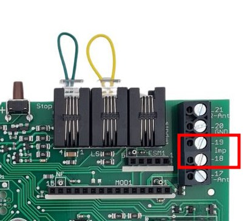
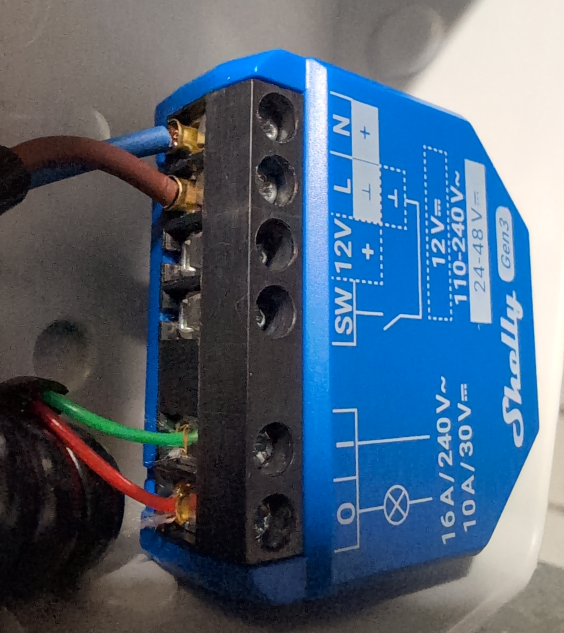
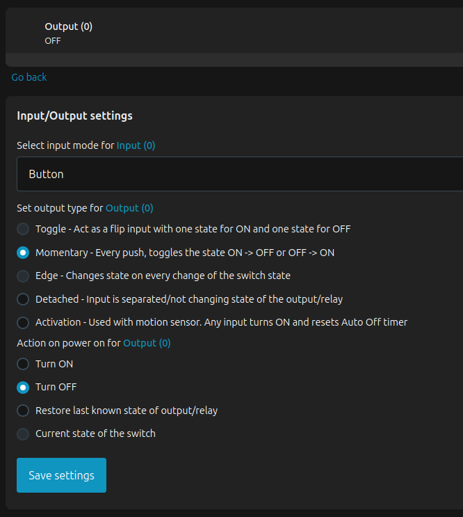
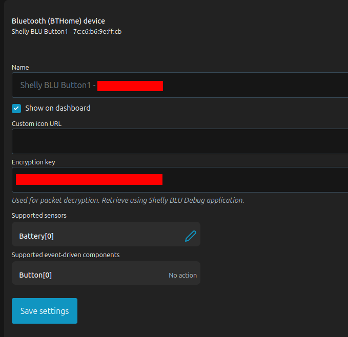

Garage doors usually come with proprietary remotes, which may have drawbacks. This page explains how to replace remotes for the **Entrematic Magic 600-2**, with the **Shelly 1 Gen3** relay and the **Shelly BLU Button Tough 1**.

**DISCLAIMER**: Electricity is dangerous, garage doors as well. I don't take any responsibility if something goes wrong by following those instructions. If you're unsure, ask a professional.

## Analysing the door operator
My Entrematic Magic 600-2 has RJ10 inputs at the back.

According to the manual:
* RJ10 input 3 is an impulse input, but pinout isn't provided.
* Terminals 18 and 19 on the PCB are impulse input as well.

Following PCB tracks we see that pins 2 and 3 of the RJ10 connector are linked to the terminals 18 and 19.

Shorting those two pins (dry contact) controls the door the same way the remote does. A simple relay can be used to control the door operation.

## Requirements and hardware selection
For this projet to be successful, following requirements are needed:

* Relay with dry contact, like pressing a wall switch would do.
* Inexpensive, sturdy and reliable remotes.
* Secure communications, as I don't want my garage to be opened with a simple replay attack.
* Backup access if my remote breaks.
* Offline operation, without Internet. The garage door is controlled only in front of it.

**DISCLAIMER**: I'm not related to Shelly by any means. Their hardware just checks all the boxes and their tech support is helpful. It's a lot of bang for the buck ! 

The **[Shelly 1 Gen3](https://www.shelly.com/products/shelly-1-gen3)** has following key characteristics:

* Dry contact relay output
* Offline operation, no internet needed.
* Built-in access point with WPA2-PSK, which allows to access the WebGUI (also as backup access)
* Integrated Bluetooth gateway which allows use of BLE remotes

The **[Shelly BLU Button Tough 1](https://www.shelly.com/products/shelly-blu-button-tough-1-black)** has following key characteristics:

* BLE with AES encryption (hard to forge messages)
* Message counter in each message (makes replay attacks very unlikely combined with AES encryption)
* Inexpensive
* Sturdy and reliable (a couple of months of testing do confirm that)

Regarding the RJ10 connector and cable, a phone headset cable I cut did the job.

 

## Setting up Shelly BLU Button Tough 1
The [Shelly BLE debug](https://play.google.com/store/apps/details?id=cloud.shelly.bledebug&hl=en-US) app is needed for that.

Procedure:

* Start the app
* Press the button
* Pair the button the with **Pair**
* Update firmware with **OTA**
* Encrypt the button (don't lose the PIN you set as you'll need it to re-pair the button)
* Get the information JSON blob with **Read** and save it somewhere safe. It contains the AES encryption key.

## Setting up Shelly 1 Gen3

You'll need the latest firmware file, a laptop with Wi-Fi and a web browser, and at least one ready remote.

### Initial device setup

* Power on the device
* Connect to the open WLAN it just created
* Set up WPA2-PSK and reconnect
* Set a password for the web interface
* Upgrade firmware to latest version
* Enable Bluetooth

### Input/Output Settings

* Input mode **Button**
* Output type **Momentary**
* Action on power on **Turn OFF**

### Output automation settings

* Auto OFF after 1 second (like pressing a wall switch)

### Add buttons

* Enter button MAC Address

* In the button detail view, enter the encryption key

* Create an action for this button

* Press the button : you should hear the relay switch and switch back after one second.

Repeat operation for each button and you're good to go !
